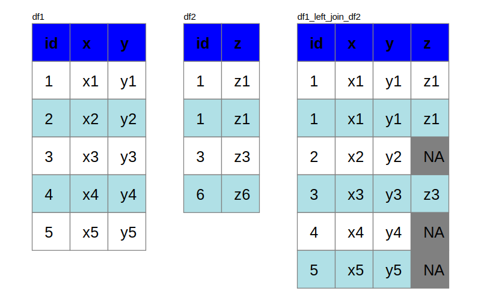

```{r setup, include=FALSE}
knitr::opts_chunk$set(echo = TRUE)
library(dplyr)
library(omsvg)
```

## Introduction

A major hurdle for non-technical folks is to understand Joins in the dplyr package. The objective of this repo is to visualize the joins hoping to bring clarity to such folks, including me in some cases.

```{r svg_table, include=FALSE}
svg_table <- function(df) {
  rows <- nrow(df)+1
  cols <- ncol(df)
  
  shw <- 50 # standard height width
  
  img <- SVG(height = (rows+2)*shw, width = (cols+2)*shw)
  
  for (rowid in seq(rows)) {
    for (colid in seq(cols)) {
      # print(paste0("RowID:",rowid," ColID:", colid))
      if (rowid == 1) {
        img <- img %>% 
          svg_rect(x = shw*colid, y = shw, width = shw, height = shw, fill = "blue", stroke = "black") %>% 
          svg_text(x = shw*colid + shw*0.33, y = shw + shw*0.66, text = colnames(df)[colid], attrs = svg_attrs_pres(font_size = 20, font_weight = "bold", font_family = "helvetica"))
      } else {
        img <- img %>% 
          svg_rect(x = shw*colid, y = shw*rowid, width = shw, height = shw, fill = "powderblue", stroke = "black") %>% 
          svg_text(x = shw*colid + shw*0.33, y = shw*rowid + shw*0.66, text = df[rowid-1, colid], attrs = svg_attrs_pres(font_size = 20, font_family = "helvetica"))
      }
    }
  }
  
  img
}
```

```{r svg_sub_table, include=FALSE}
svg_sub_table <- function(svg, df, x = 0, y = 0, shw = 50, missing_text = "NA", show_name = TRUE) {
  df_name <- as.character(substitute(df))
  df[is.na(df)] <- missing_text
  rows <- nrow(df)+1
  cols <- ncol(df)

  for (rowid in seq(rows)) {
    for (colid in seq(cols)) {
      # print(paste0("RowID:",rowid," ColID:", colid))
      if (rowid == 1) {
        svg <- svg %>% 
          svg_rect(x = x + shw*colid, y = y + shw*rowid, width = shw, height = shw, fill = "blue", stroke = "grey") %>% 
          svg_text(x = x + shw*colid + shw*0.33, y = y + shw*rowid + shw*0.66, text = colnames(df)[colid], attrs = svg_attrs_pres(font_size = 20, font_weight = "bold", font_family = "helvetica"))
      } else {
        svg <- svg %>% 
          svg_rect(x = x + shw*colid, y = y+shw*rowid, width = shw, height = shw, fill = ifelse(df[rowid-1, colid] == missing_text,"grey", ifelse((rowid-1)%%2==0,"powderblue","white")), stroke = "grey") %>% 
          svg_text(x = x + shw*colid + shw*0.33, y = y+shw*rowid + shw*0.66, text = df[rowid-1, colid], attrs = svg_attrs_pres(font_size = 20, font_family = "helvetica"))
      }
    }
  }
  # Add Name
  if (show_name) {
    svg <- svg %>% 
      svg_text(x = x + shw, y = shw-5, text = df_name, 
               attrs = svg_attrs_pres(font_size = 12, font_family = "helvetica"))
  }
  
  svg
}


```

## Left Join

Here, we will define the two tables `df1` and `df2` and perform a `left_join` on them.  
In the `left_join`, all rows in the left table `df1` are included and the rows with matching `id` in `df2` are included. If `df2` contains multiple rows for same `id`, the rows in `df1` get repeated for each unique value in `df2`. All rows in `df2` without an `id` match are excluded. All rows in `df1` without matching `id` in `df2` will be blank or `NA`

```{r eval=FALSE}
df1 <- data.frame(id = 1:5,
                  x = paste0("x", 1:5),
                  y = paste0("y", 1:5))

df2 <- data.frame(id = c(1, 1, 3, 6),
                  z = c("z1", "z11", "z3", "z6"))

df1_left_join_df2 <- left_join(df1, df2, by = "id")

SVG(width = 700, height = 450) %>% 
  svg_sub_table(df = df1)  %>% 
  svg_sub_table(df = df2, x = 200) %>% 
  svg_sub_table(df = df1_left_join_df2, x = 350)
```


