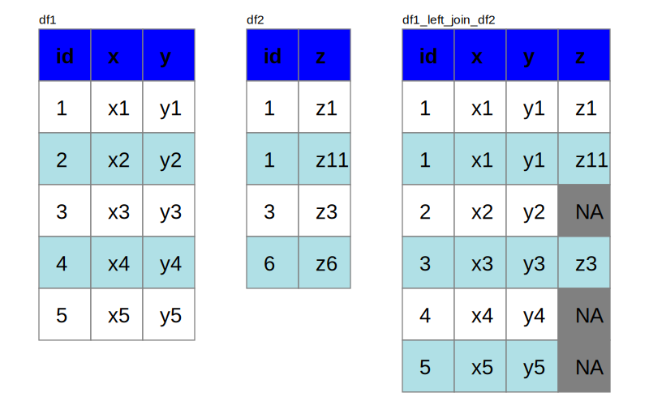

dplyr Joins
================

## Introduction

A major hurdle for non-technical folks is to understand Joins in the
dplyr package. The objective of this repo is to visualize the joins
hoping to bring clarity to such folks, including me in some cases.

## Left Join

Here, we will define the two tables `df1` and `df2` and perform a
`left_join` on them.  
In the `left_join`, all rows in the left table `df1` are included and
the rows with matching `id` in `df2` are included. If `df2` contains
multiple rows for same `id`, the rows in `df1` get repeated for each
unique value in `df2`. All rows in `df2` without an `id` match are
excluded. All rows in `df1` without matching `id` in `df2` will be blank
or `NA`

``` r
df1 <- data.frame(id = 1:5,
                  x = paste0("x", 1:5),
                  y = paste0("y", 1:5))

df2 <- data.frame(id = c(1, 1, 3, 6),
                  z = c("z1", "z11", "z3", "z6"))

df1_left_join_df2 <- left_join(df1, df2, by = "id")

SVG(width = 700, height = 450) %>% 
  svg_sub_table(df = df1)  %>% 
  svg_sub_table(df = df2, x = 200) %>% 
  svg_sub_table(df = df1_left_join_df2, x = 350)
```


